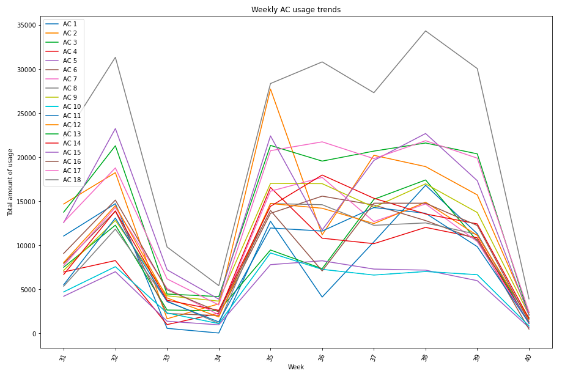

# AC Usage Analysis Project

This project is aimed at discovering trends in AC usage across for 18 different ACs. 
The Project also forecasts next 10 days usage based on previous usage trends.

More details can be found in IPython Notebook.

## Screenshots

